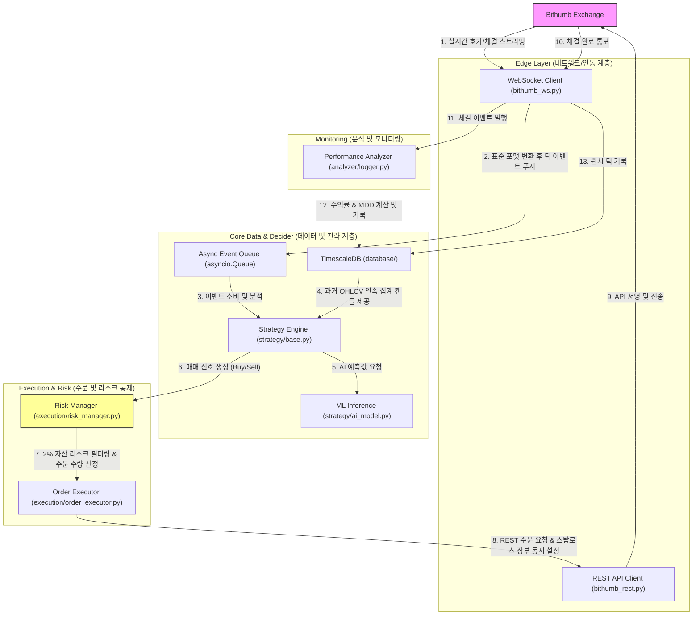
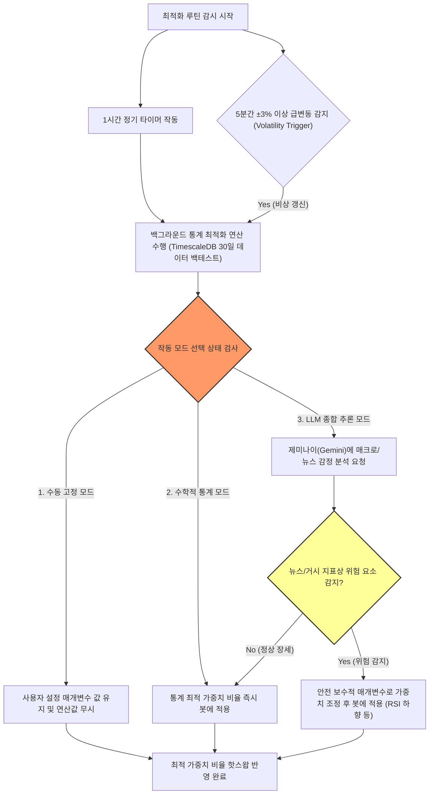

# 암호화폐 자동매매 시스템 종합 설계 문서 (System Architecture Design)

본 문서는 [coin.md](file:///c:/260606coin/coin.md)의 핵심 설계 이념을 바탕으로 구축되는 **기관급 비동기 이벤트 구동형 암호화폐 자동매매 시스템**의 전체 소프트웨어 구조, 화면 구성, 그리고 트레이딩 비즈니스 로직을 규정합니다.

---

## 1. 시스템 아키텍처 다이어그램

### 1.1 전체 컴포넌트 이벤트 흐름 (Decoupled Event Flow)
시스템 컴포넌트들은 상호 의존성을 배제하기 위해 메시지 큐와 비동기 이벤트를 활용해 데이터를 교환합니다.



### 1.2 실시간 파라미터 자동 최적화 및 모드 제어 흐름 (Auto-Optimization & Mode Control)
통계적 기법의 가중치 비율 최적화 및 외부 인공지능(LLM) 검증 제어 메커니즘을 나타낸 흐름도입니다.



---

## 2. 디렉토리 구조 및 컴포넌트 역할 명세

| 디렉토리 / 파일 | 클래스/모듈명 | 핵심 기능 | 비고 (참고 규칙/스킬) |
| :--- | :--- | :--- | :--- |
| [main.py](file:///c:/260606coin/main.py) | `TradingBotApp` | 메인 비동기 루프 오케스트레이션, `SIGINT` 처리, 비상 정지 절차 구동 | [graceful-shutdown.md](file:///c:/260606coin/.agents/rules/graceful-shutdown.md) |
| `config/` | `settings` | 거래 코인 리스트, 가용한 시드머니, API 접속 파라미터 관리 | Dynamic Symbol List 적용 |
| `exchange/` | `BithumbRestClient` | JWT 토큰 서명 발행, REST API 주문 집행, 429 레이트 리밋 예외 복구 | [rate-limits.md](file:///c:/260606coin/.agents/rules/rate-limits.md) / [bithumb-api-helper](file:///c:/260606coin/.agents/skills/bithumb-api-helper/SKILL.md) |
| | `BithumbWebsocketClient` | 웹소켓 실시간 체결/호가 수신, Heartbeat 유지, 자동 재접속 | |
| `database/` | `TimescaleDBManager` | 데이터베이스 연결 관리, 원시 틱 적재, 연속 집계 캔들 데이터 로드 | TimescaleDB Hypertable 활용 |
| `strategy/` | `StrategyEngine` | 캔들 데이터 및 기법 가중치 비율을 결합해 매매 신호(`BUY`, `SELL`, `HOLD`) 결정 | |
| | `FreqaiModel` | 머신러닝 예측 추론, 백그라운드 학습 및 핫스왑 처리 | [async-nonblocking.md](file:///c:/260606coin/async-nonblocking.md) |
| `execution/` | `RiskManager` | 2% 자산 손실 한도 검사, 자산 잔고 확인, 주문 가격/수량 단위 포맷팅 | [precision.md](file:///c:/260606coin/.agents/rules/precision.md) / `risk-management.md` |
| | `OrderExecutor` | 빗썸 거래소에 주문 제출, 스탑로스 주문 동시 접수, 부분 체결 모니터링 | |
| `analyzer/` | `PerformanceAnalyzer` | 매매 건별 성과 분석, 실시간 MDD 측정 및 DB 적재 | |

---

## 3. 피그마 기반 8개 화면 구성 명세 (UX Wireframe Spec)

시스템은 총 8개의 모니터링 및 설정 화면으로 분할되어 작동하며, 모든 화면은 피그마 디자인 규격에 따라 **한글로 일관성 있게 시각화**되어 있습니다.

1. **Screen 1: 종합 대시보드 (Dashboard)**
   * 자산 가치, 2% 리스크 한도 검사, 실시간 BTC/KRW 틱 캔들 차트, FreqAI 모델 예측 상태 및 미청산 활성 포지션을 종합적으로 관제합니다.
2. **Screen 2: 가동 중인 전략 (Active Strategies)**
   * 로드된 AI 모델들의 학습 정확도, FreqAI 하이퍼파라미터 셋과 벤치마크 대비 누적 백테스팅 수익률 곡선(AI vs Buy & Hold)을 표시합니다.
3. **Screen 3: 상세 거래 내역 (Trade History)**
   * 누적 거래 횟수, 85.2%의 승률, Profit Factor, 최대 낙폭(MDD) 등의 종합 지표와 주문 체결 내역(주문 ID, 체결가, 수량, 실현 손익 등)을 제공합니다.
4. **Screen 4: 시계열 DB 상태 (TimescaleDB Status)**
   * 데이터베이스 용량 상태와 더불어 실시간 1분/5분/1시간봉 구체화 뷰 생성기(Continuous Aggregates)의 정상 가동 상태를 감시합니다.
5. **Screen 5: 시스템 로그 콘솔 (System Logs Console)**
   * 로그 레벨 필터링 설정(전체, 정보, 경고, 오류, 리스크, API)을 통해 백그라운드 터미널 로그 원본을 모니터링합니다.
6. **Screen 6: 수동 및 조건 설정 (Manual & Conditional Trading)**
   * 지정가/시장가 수동 매수·매도 주문 집행과 보조지표 조건부 자동매매 규칙(RSI, 볼린저 밴드 등) 활성 여부를 조율하며, **판단 신호 충돌 시 매수/매도 우선권**을 설정합니다.
7. **Screen 7: 통합 트레이딩 데스크 (Unified Trading Desk / Pro-Desk)**
   * 실시간 차트, 수동 주문 콘솔, 포지션 현황 테이블, 그리고 **제미나이(Gemini) AI의 실시간 투자 의사결정 브리핑 보고서**를 한 화면에 통합 결합한 고성능 매매 집중 화면입니다.
8. **Screen 8: 종목별 전략 믹서 (Asset Strategy Mixer / Hybrid Strategy Desk)**
   * 각 가상자산 종목의 감시 상태(수동 제어 vs AI 위임)를 분리하고 기법 가중치 비율을 도넛 차트 및 슬라이더로 조율하며, 예상 백테스트 수익률과 AI 작업 로그 타임라인을 종합적으로 감시하는 하이브리드 전략 관제 센터입니다.

---

## 4. 핵심 비즈니스 로직 및 거래 제약 조건

### 4.1 가상자산 종목의 동적 관리
* 사용자가 Screen 8에서 감시할 코인 종목 코드(예: `KRW-XRP`)를 동적으로 입력하고 추가/삭제할 수 있습니다. 
* 종목이 추가되면, 백엔드의 `TimescaleDBManager`는 즉시 해당 종목에 대한 시계열 데이터 수집 스케줄을 추가하고 FreqAI의 추론 파이프라인을 작동시킵니다.

### 4.2 종합판단 75% 이상 기준 실시간 자동 매수
* FreqAI 추론 신뢰도, 보조지표 가중치, 그리고 실시간 외부 LLM 시황 점수를 종합 합산하여 0~100%의 **종합판단 신뢰도 점수**를 매초 계산합니다.
* 이 점수가 사용자가 설정한 한계치(기본 **75%**)를 돌파하는 즉시, 빗썸 REST API를 트리거하여 즉각적인 시장가(또는 지정가) 자동 매수 주문을 송출합니다.

### 4.3 종목별 최적 기법 포트폴리오 비율 설정 및 AI 하이브리드 제어
* 코인마다 변동성 구조가 다르므로 종목별로 적용할 매매 기법(FreqAI 추세 예측, 볼린저 밴드 역추세, RSI 돌파, MACD 등)의 가중치 비율을 개별 매칭합니다. 
* 본 시스템은 사용자가 직접 가중치를 조절하는 **수동 제어(Manual)**와 AI가 스스로 가중치를 핫스왑하는 **AI 오토파일럿(AI Autopilot)** 모드를 지원하며, 핵심 제어 패널(Strategy Mixer)을 통해 조율됩니다.

#### 4.3.1 제어 모드 상세 동작
1. **수동 제어 모드 (Manual Mode)**:
   - 사용자가 UI의 슬라이더(Slider) 바를 수동 드래그하여 기법별 비율(예: FreqAI 50% + 볼린저 밴드 30% + RSI 20%)을 조정합니다.
   - AI 엔진은 백그라운드에서 실시간 분석을 진행하며, 횡보세가 강한 경우 "그리드 매매 비율 20% 늘림 추천"과 같은 **AI 실시간 추천 카드(Recommendation)**를 팝업하고 사용자가 `적용하기` 버튼을 누르면 실시간 반영합니다.
2. **AI 오토파일럿 모드 (AI Autopilot Mode)**:
   - FreqAI와 과거 30일 시계열 백테스팅 엔진이 시장을 감시하여 가격 급변, 거래량 급증, 뉴스 거시 이벤트 감지 시 최적 비율로 전략들을 자율적으로 믹싱(Re-balancing)합니다.
   - 기법 가중치 조정 완료 즉시 도넛 차트 및 슬라이더 UI가 스무스한 트랜지션 애니메이션과 함께 실시간으로 변경됩니다.

#### 4.3.2 AI 활동 로그 타임라인 (AI Activity Log Table Spec)
AI 오토파일럿의 신뢰성을 담보하고 동작 근거(Why)를 검증하기 위해, AI가 비율을 갱신하거나 새로운 전략 필터를 대입할 때마다 데이터베이스에 이력 로그를 누적합니다.
```sql
CREATE TABLE ai_activity_log (
    id INTEGER PRIMARY KEY AUTOINCREMENT,
    timestamp TIMESTAMPTZ DEFAULT CURRENT_TIMESTAMP, -- 로그 발생 시각
    symbol TEXT NOT NULL,                             -- 대상 가상자산 기호
    action TEXT NOT NULL,                             -- 적용 조치 (예: '추세추종 비율 10% 상향')
    reason TEXT NOT NULL                              -- 조정 사유 (예: '거래량 급증 및 돌파 장세 감지')
);
```

### 4.4 실시간 파라미터 비율 최적화 주기 및 예외 처리 (1시간 기본 + 변동성 트리거)
* **기본 주기 (1시간)**: 1분/10분 단위의 잦은 갱신은 시장 노이즈에 반응해 과최적화 및 과도한 수수료 낭비를 유발하므로, 평시에는 **1시간** 주기로 최적 비율을 백그라운드 연산하여 핫스왑 반영합니다.
* **변동성 트리거 (예외 우회 규칙)**: 만약 5분 동안 종목 가격이 **±3% 이상 폭등락**하는 급격한 변동성이 감지될 경우, 1시간 타이머를 무시하고 **즉시 파라미터 최적화를 재연산**하거나 사전 설정된 리스크 보호용 안전 비율(Safe Ratio)로 즉각 전환합니다.

### 4.5 외부 인공지능(LLM) 판단 제어 스위치 규칙 (Option Toggle)
사용자가 외부 AI(제미나이 등)의 맥락 필터링 판단 결과가 마음에 들지 않거나 오작동을 우려할 경우 다음 3가지 모드로 완벽히 격리 제어할 수 있습니다.
1. **수동 고정 모드**: 인공지능이나 통계적 자동 보정을 끄고 사용자가 직접 셋업한 고정 매개변수만 사용합니다.
2. **수학적 통계 최적화 모드**: 30일 시계열 데이터 백테스팅 결과만 기계적으로 반영합니다 (생성형 AI 필터 제외).
3. **LLM 종합 추론 모드**: 수학적 계산 최적값 위에 제미나이의 실시간 거시 이슈/뉴스/온체인 리스크 감정 필터링을 적용해 최종 가중치를 결정합니다.

### 4.6 매매 판단 충돌 시 의사결정 우선순위 설정 규칙 (Signal Conflict Priority Rules)
AI 모델과 사용자 설정 보조지표 조건이 상반된 신호를 낼 경우, 사용자가 각 행위별 최우선권 실행 대상을 선택하여 연쇄 손실을 예방합니다. 본 설정은 **종목별(선택된 코인) 독립 저장 및 가동 구조**를 취하며, SQLite 메타데이터 설정 테이블에 개별 기록됩니다.

* **매수(Buy) 신호 경합 시**:
  * `AI 판단 우선 (권장)`: 백그라운드 통계 학습 결과가 검증되었으므로 AI 판단을 최우선하여 진입합니다.
  * `사용자 규칙 우선`: AI가 매수 시그널을 내도 사용자의 RSI 과매수 차단 등 사전 필터링에 부합할 때만 통과합니다.
* **매도(Sell) 신호 경합 시 (수동 즉시 매도 AI '후보고' 어시스트 규칙 포함)**:
  * `AI 판단 우선`: AI의 홀드 또는 트레일링 스탑 결정을 신뢰하고 매도를 대기합니다.
  * `사용자 규칙 우선 (보수적 자산 보호)` (기본 권장값): AI의 추세 예측이 홀드 신호라 하더라도, 사용자가 리스크 매니저에 명시한 하드 손절선(2%) 등에 도달하면 AI 판단을 완전히 무시하고 즉각 시장가 매도 주문을 송출하여 자본 잠식을 방어합니다.
  * **수동 즉시 매도 보호 필터 (AI 후보고 및 경고창 연동)**: 
    사용자가 수동으로 즉시 매도(SELL)를 전송할 시, 시스템은 즉각 거래소에 주문을 전송하지 않고 최대 **1.5초** 동안 AI 시장 검증 모듈을 기동합니다.
    1. AI가 1.5초 이내에 분석을 마쳐 "현재 지지선 등으로 매도할 상황이 아닙니다"라고 응답하면, 화면에 안내 경고창(Confirm Modal)을 호출합니다.
    2. 사용자가 경고창에서 `매도 강행(진행)`을 클릭하면 주문을 거래소로 전송하고, `매도 취소(대기)`를 클릭하면 주문을 드롭합니다.
    3. 만약 1.5초 이내에 AI 분석이 지연되거나 반환되지 않는 경우, 속도 보장을 위해 예외 처리를 작동하여 지체 없이 사용자의 수동 매도 주문을 거래소로 전송합니다.

---

## 5. 시스템 리스크 제어 및 안전장치 설계

### 5.1 비상 정지 절차 (Graceful Shutdown)
프로세스에 종료 시그널(`SIGINT`/`SIGTERM`)이 포착되거나 치명적인 런타임 에러 발생 시 최우선적으로 포지션을 플래닝(Flatten)합니다.
1. 새로운 주문 진입을 즉시 차단(Freeze).
2. 빗썸 거래소 내 모든 미체결 지정가 주문 즉시 취소 (REST API).
3. 현재 보유 중인 모든 포지션을 시장가 매도 청산 (REST API).
4. 마지막 자산 상태 및 장애 로그를 DB에 기록하고 프로세스를 안전하게 종료.

### 5.2 고정 비율 포지션 사이징 (2% Rule)
단일 거래에서 발생할 수 있는 최대 손실액이 전체 운용 자산의 **2%**를 넘지 않도록 주문 집행 전 Risk Manager 필터가 수량을 강제 제한합니다.
* 주문 금액 산정 시 진입단가와 설정된 손절선(Stop-Loss)간의 폭을 계산하여 2% 리스크 한도 내에 들어오는 계약 수만 빗썸으로 송출합니다.

---

## 6. 데이터베이스 테이블 설계 (TimescaleDB)

### 6.1 원시 틱 데이터 테이블 (Raw Tick Table)
```sql
CREATE TABLE tick_data (
    time TIMESTAMPTZ NOT NULL,            -- 체결 발생 시각 (Primary Partition)
    symbol TEXT NOT NULL,                  -- 거래 쌍 (예: 'KRW-BTC')
    trade_price NUMERIC(20, 8) NOT NULL,   -- 체결 가격
    trade_volume NUMERIC(20, 8) NOT NULL,  -- 체결 수량
    ask_bid TEXT NOT NULL                  -- 매수/매도 구분 ('ASK' or 'BID')
);

-- 시간 기준 하이퍼테이블로 전환 (TimescaleDB 고속 분할 파티셔닝)
SELECT create_hypertable('tick_data', 'time');
```

### 6.2 연속 집계 캔들 뷰 (Continuous Aggregates)
```sql
-- 1분봉 요약 연속 집계 생성
CREATE MATERIALIZED VIEW ohlcv_1m
WITH (timescaledb.continuous) AS
SELECT
    time_bucket('1 minute', time) AS bucket,
    symbol,
    first(trade_price, time) AS open,
    max(trade_price) AS high,
    min(trade_price) AS low,
    last(trade_price, time) AS close,
    sum(trade_volume) AS volume
FROM tick_data
GROUP BY bucket, symbol;
```
